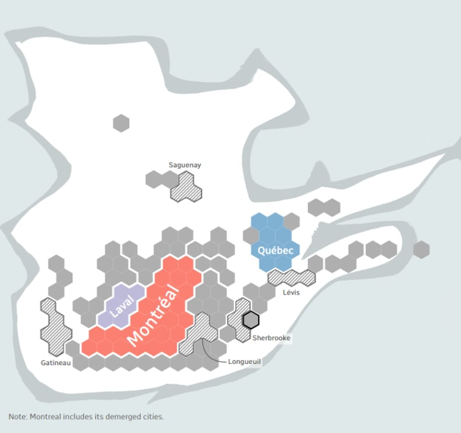
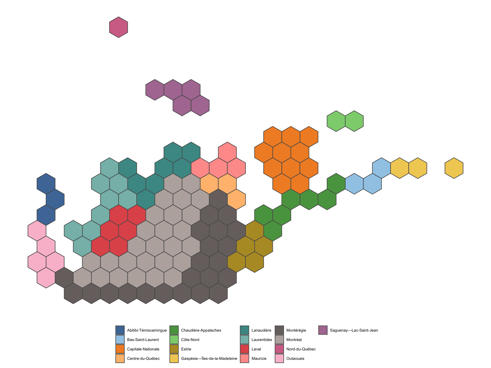
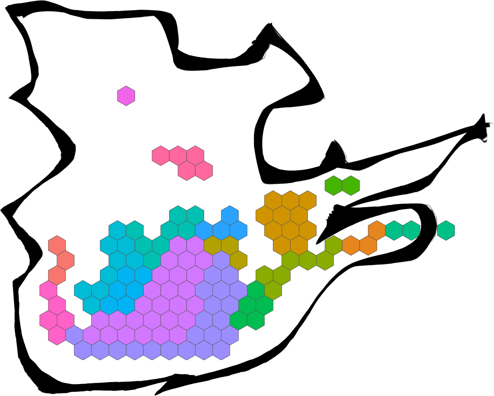

# Quebec GeoJSON Hexes

The CBC covered the recent (as of the intial commit of this repo) [Quebec elections](https://www.cbc.ca/news/canada/montreal/8-maps-that-explain-quebec-s-surprise-election-results-1.4848794) and used a well-crafted hex grid map to display results:



They have a [great 'splainer](https://ici.radio-canada.ca/special/2018/elections-quebec/circonscriptions-portrait-cartes-vote-analyse-politique/en) on why they use this type of map.

Thinking that it may be useful for others, I wrangled out the hexes using [`svg2geojson`](https://www.npmjs.com/package/svg2geojson) and put them into a GeoJSON file (`quebec-ridings.geojson`) along with some metadata that I extracted from the minified javascript from the CBC's site using the [`V8`](https://cran.r-project.org/web/packages/V8/index.html) package.

Here's an example of using it in R:

``` r
library(sf)
library(ggplot2)

sf::st_read("quebec-ridings.geojson", quiet=TRUE, stringsAsFactors=FALSE) %>% 
  ggplot() +
  geom_sf(aes(fill=regionname)) +
  coord_sf(datum=NA) +
  ggthemes::scale_fill_tableau(name = NULL, "Tableau 20") +
  ggthemes::theme_map() +
  theme(legend.position = "bottom")
```



And, with a _little_ ggplot2-tweaking, we can even put it in the CBC-styled border:

``` r
library(sf)
library(magick)
library(ggplot2)

plt <- image_graph(1488, 1191, bg = "white")
sf::st_read("quebec-ridings.geojson", quiet=TRUE, stringsAsFactors=FALSE) %>% 
  ggplot() +
  geom_sf(aes(fill=regionname)) +
  coord_sf(datum=NA) +
  scale_x_continuous(expand=c(0,2)) +
  scale_y_continuous(expand=c(0,0)) +
  ggthemes::theme_map() +
  theme(plot.margin = margin(t=150)) +
  theme(legend.position = "none")
dev.off()

image_composite(plt, image_read("imgs/background.png")) %>% 
  image_write("imgs/composite-map.png")
```



You can tweak the border color with `magick` as needed and there's a `background2.png` in the `imgs` directory that has the white inset that you can further composite as needed.

With a teensy bit of work you should be able adjust the stroke color via `aes()` to separate things as the CBC did.

### NOTE

The CBC made the original polygons for the hexes (well, they made a set of gridpoints and open source software turned it into a set of SVG paths) and the background images. All I did was some extra bit of wrangling and conversioning. The R code above and the GeoJSON file are released with under the MIT license. You'll have to check with the CBC for commercial uses of the background PNGs (I suspect they'd be OK with FOSS usage of them but we'll find out if I get a cease & desist :-).